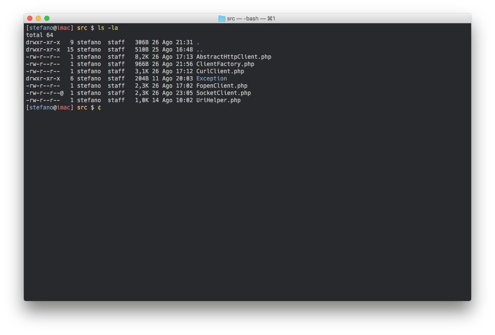
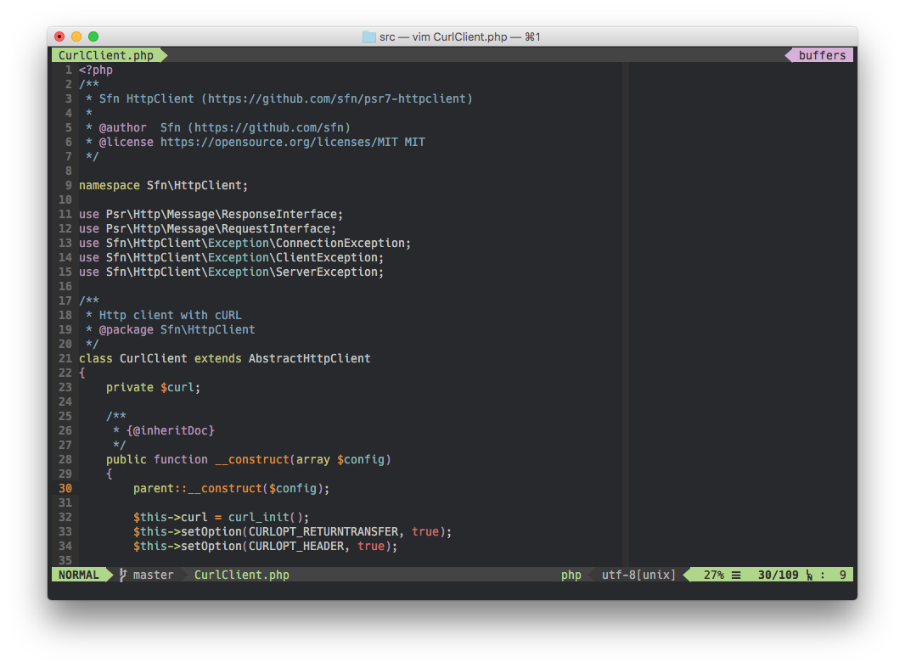

# .dotfiles

## Terminal.app

* Color scheme: Tomorrow Night
* Font: [Hack](https://github.com/chrissimpkins/Hack) 13pt
* Tutto il resto nel file [`.bashrc`](.bashrc)

## Vim

* [Pathogen](https://github.com/tpope/vim-pathogen)
* [Airline](https://github.com/vim-airline/vim-airline) + [Themes](https://github.com/vim-airline/vim-airline-themes)
* [Fugitive](https://github.com/tpope/vim-fugitive)
* Tutto il resto nel file [`.vimrc`](.vimrc)
